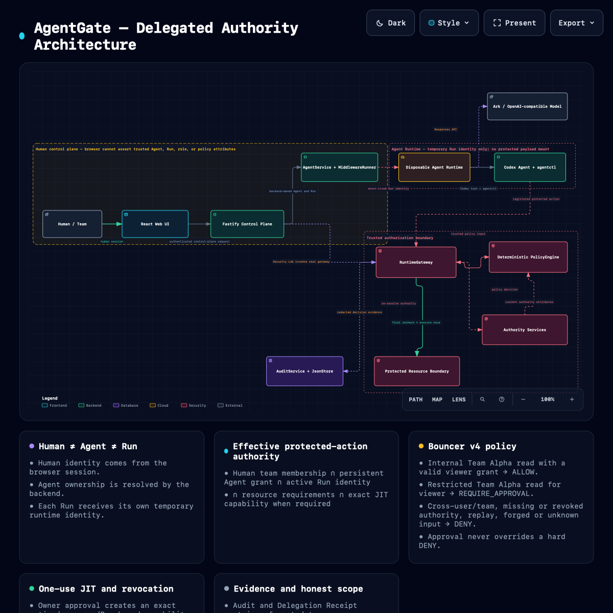
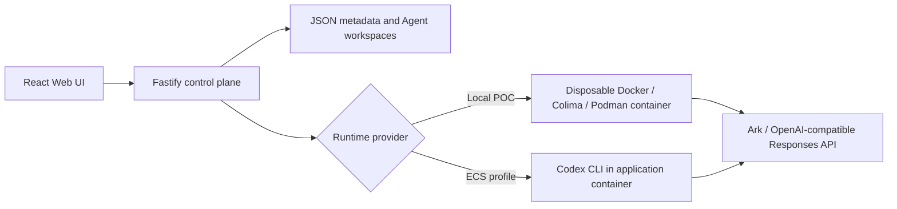

# Volc Agent Launchpad

A minimal Agent platform for three-day middleware hackathons. It provides Agent
CRUD, a browser Playground, persistent workspaces, and **AgentGate**:
backend-enforced delegated identity and authorization for autonomous Agents.

AgentGate separates Human, Agent, and Run authority. A human's permission does
not automatically become an Agent's permission: persistent Agent grants are
narrow, every Run has temporary identity, and each registered protected action
is evaluated at a trusted backend gateway.

Run it locally with Docker, Colima, or rootless Podman, or deploy it to
Volcengine ECS.

> [!WARNING]
> This is a proof of concept. AgentGate protects only registered actions routed
> through `agentctl`; it does not intercept every internal Codex shell or file
> operation. Do not use production data or credentials. See [SECURITY.md](SECURITY.md).

## Screenshots

### Agent Playground


### Create an Agent


## Features

- React and TypeScript Web UI
- Agent create, edit, start, stop, delete, and multi-turn chat
- Fastify control plane with asynchronous Run state
- Persistent Agent workspaces and Codex sessions
- AgentGate identity, ownership, approval, one-use capability, and redacted audit evidence
- Human != Agent != Run separation with backend-owned Agent ownership and
  short-lived trusted Runtime identity per Run
- Team memberships plus persistent Team Agent grants with independent viewer,
  editor, and admin roles, action scope, optional expiry, bundle evidence, and
  explicit grant revocation
- `bouncer-v4` deterministic policy with cross-user/cross-team hard deny,
  trusted server-side attribute resolution, replay/idempotency protection, and
  final pre-side-effect authorization rechecks
- Owner approval for high-risk production deploys and exact one-use JIT
  elevation for restricted team-file reads; JIT never mutates the Agent's
  persistent viewer grant
- Redacted audit timeline and Delegation Receipt with policy version, reason,
  enforcement point, safe authority evidence, and side-effect status
- Local/demo-only Security Lab that exercises the real RuntimeGateway for
  allow, deny, JIT, replay, forged-input, grant/Run revocation, and queued
  stale-allow denial scenarios
- Disposable Docker, Colima, or Podman container for each local turn
- Docker and Terraform deployment paths for Volcengine ECS

## Selected middleware track: Bouncer

AgentGate demonstrates backend-enforced delegated access. A Run gets a scoped
short-lived identity, the Bouncer checks the backend-owned human/Agent/resource
relationship, and only the RuntimeGateway can invoke a registered protected
action. User A can read `project-a`; User B's resource is denied. Production
deploy requires owner approval, produces a one-use capability, and leaves a
redacted audit trail. Owner revocation invalidates the active Run identity and
its capabilities. A standards-informed extension lets a team admin persistently
enroll an owned Agent with a narrow file-read role. Human membership, Agent
grant, Run identity, and resource threshold must all agree; a viewer grant can
request restricted access only through explicit one-use owner approval. The
Runtime cannot assert any of them. See the
[AgentGate overview](docs/agentgate/overview.md),
[standards alignment](docs/agentgate/standards.md), and
[three-minute demo](docs/agentgate/demo.md).

## Architecture

AgentGate separates Human, Agent, and Run authority and enforces registered
protected actions through a trusted backend authorization boundary.

[](https://cloudkai.github.io/CodeJam/agentgate/architecture.html)

Explore the [interactive AgentGate architecture](https://cloudkai.github.io/CodeJam/agentgate/architecture.html)
or read the [GitHub-friendly architecture overview](docs/agentgate/architecture.md).

## Requirements

- Node.js 22+
- npm 10+
- Docker, Colima, or Podman
- Either a Volcengine Ark credential or an OpenAI-compatible Responses API
  credential and model

Codex CLI is included in the Runtime image and is not required on the host.

## Local browser SOP

### 1. Check the local tools

Install Node.js 22+ and one supported container engine, then verify them:

```bash
node --version
npm --version
docker --version        # Docker Desktop, Docker Engine, or Colima
podman --version        # Use this instead when running Podman
```

Only one container engine is required. Codex CLI is already included in the
Runtime image.

### 2. Clone the repository

```bash
git clone <repository-url> volc-agent-launchpad
cd volc-agent-launchpad
```

Skip this step when already working from the repository root.

### 3. Start the POC

```bash
APP_AUTH_TOKEN=techjam-local-demo-token-123456 \
ARK_API_KEY=your-ark-api-key \
ARK_MODEL=ep-your-endpoint-id \
npm run poc
```

To use OpenAI or another provider with an OpenAI-compatible Responses endpoint:

```bash
APP_AUTH_TOKEN=techjam-local-demo-token-123456 \
MODEL_PROVIDER=openai-compatible \
OPENAI_API_KEY=your-openai-api-key \
OPENAI_MODEL=gpt-5 \
OPENAI_BASE_URL=https://api.openai.com/v1 \
npm run poc
```

`OPENAI_BASE_URL` can point to another provider's compatible endpoint. The
runtime uses the Responses API wire format and passes the selected provider's
key only to the Codex Runtime.

The first run installs Node.js dependencies and builds the Runtime image. The
script automatically selects Docker, Colima, or Podman.

### 4. Open the browser

Visit <http://localhost:3000>, or open it from the terminal:

```bash
open http://localhost:3000       # macOS
xdg-open http://localhost:3000   # Linux desktop
```

In the Web UI:

1. Select **Create Agent**.
2. Enter a name, description, and workspace instructions.
3. Select **Create Agent** again.
4. Enter a task in the Playground, for example:

   ```text
   Create a TypeScript hello-world CLI, add a test, and run it.
   ```

The Agent can write files, run commands, and continue the same Codex session in
later messages.

Protected AgentGate actions use the installed `agentctl` command. The official
`npm run poc` container installs it automatically. Protected-action credentials
are intentionally not injected into `local-process` Runs because the Agent and
server child process share a filesystem there; use the disposable container
Runtime for the protected-action demo. Normal coding Runs continue to work in
either provider.

The Web UI also exposes a **Delegation receipt** for the latest approval and a
**Revoke access** control while a Run is active. For User A's Team Alpha admin
fixture, it also exposes persistent Agent enrollment and revocation. These
controls show safe metadata and status only; they do not expose credentials or
protected payloads. When `AGENTGATE_SECURITY_LAB_ENABLED=true`, the side panel
also exposes real-gateway checks for allow, cross-user/cross-team deny, JIT
approval and replay denial, forged trusted-field rejection, Run/grant
revocation, and a queued initial-allow → revoke → final-recheck denial. The
Lab is a supporting demonstration, not a second authorization engine; it keeps
synthetic runtime credentials and protected payloads server-side and cleans up
terminal demo Run authority.

### 5. Stop and resume

Press `Ctrl+C` in the startup terminal. The script removes temporary Runtime
containers but keeps Agent workspaces and conversations.

- macOS state: `~/.volc-agent-launchpad/`
- Linux state: `.local/`
- Custom location: set `LOCAL_POC_DATA_ROOT`

Run the same `npm run poc` command to continue later.

### Select a specific container engine

Force Podman when multiple engines are installed:

```bash
CONTAINER_ENGINE=podman \
APP_AUTH_TOKEN=techjam-local-demo-token-123456 \
ARK_API_KEY=your-ark-api-key \
ARK_MODEL=ep-your-endpoint-id \
npm run poc
```

Colima uses `CONTAINER_ENGINE=docker` because it exposes the Docker CLI.

For a clean Linux host, follow the
[rootless Podman setup](docs/LOCAL_POC.md#rootless-podman-on-linux).

## Docker Compose

Create and edit the configuration:

```bash
./scripts/bootstrap-local.sh
```

Required values in `.env`:

```dotenv
MODEL_PROVIDER=ark
ARK_API_KEY=your-ark-api-key
ARK_MODEL=ep-your-endpoint-id
APP_AUTH_TOKEN=replace-with-at-least-24-random-characters
```

For OpenAI-compatible mode, use `MODEL_PROVIDER=openai-compatible` together
with `OPENAI_API_KEY`, `OPENAI_MODEL`, and optionally `OPENAI_BASE_URL`.

Start the application:

```bash
docker compose up --build
```

Open <http://localhost:3000>. Stop it without deleting Agent data:

```bash
docker compose down
```

## Development

```bash
npm install
cp .env.example .env
npm install --global @openai/codex@0.111.0
npm run dev
```

- Web UI: <http://localhost:5173>
- API: <http://localhost:3000>

Use local paths in `.env` when running outside Docker:

```dotenv
APP_DATA_DIR=.data
AGENT_WORKSPACE_ROOT=workspaces
CODEX_HOME=codex-home
```

## Deployment

- [Existing Linux ECS with Docker](docs/DEPLOYMENT.md#existing-linux-ecs)
- [Complete Volcengine environment with Terraform](docs/DEPLOYMENT.md#terraform-deployment)
- [Local Docker, Colima, and Podman details](docs/LOCAL_POC.md)

The existing-ECS script deploys from the current source tree:

```bash
cp .env.example .env.production
./scripts/deploy-existing-ecs.sh .env.production
```

The Terraform path provisions VPC, subnet, security group, ECS, and EIP:

```bash
cp deploy/volcengine/terraform.tfvars.example \
  deploy/volcengine/terraform.tfvars
./scripts/deploy-volcengine.sh
```

## Configuration

| Variable | Default | Purpose |
| --- | --- | --- |
| `MODEL_PROVIDER` | `ark` | `ark` or `openai-compatible`. |
| `ARK_API_KEY` | Required for Ark | Ark model API key. |
| `ARK_MODEL` | Required for Ark | Responses-capable endpoint or model ID. |
| `ARK_BASE_URL` | Beijing v3 endpoint | Ark OpenAI-compatible API URL. |
| `OPENAI_API_KEY` | Required for OpenAI-compatible | OpenAI or compatible provider API key. |
| `OPENAI_MODEL` | Required for OpenAI-compatible | Responses-capable model ID. |
| `OPENAI_BASE_URL` | `https://api.openai.com/v1` | OpenAI-compatible Responses API URL. |
| `APP_AUTH_TOKEN` | Empty on loopback | Shared demo token; use 24+ random characters remotely. |
| `RUNTIME_PROVIDER` | `local-process` | `container` for disposable local Runtime containers. |
| `CODEX_SANDBOX_MODE` | `workspace-write` | Codex inner sandbox mode. |
| `CODEX_TIMEOUT_MS` | `600000` | Maximum duration of one turn. |
| `AGENTGATE_GATEWAY_URL` | `http://127.0.0.1:<PORT>` | Runtime gateway URL injected into each Run. |
| `AGENTGATE_APPROVAL_WAIT_MS` | `90000` | Maximum time `agentctl` waits for owner approval. |
| `AGENTGATE_SECURITY_LAB_ENABLED` | `false` | Enables the redacted local/demo Security Lab. |
| `LOCAL_POC_DATA_ROOT` | Platform-specific | Local metadata, workspace, and session directory. |

See [.env.example](.env.example) for all Runtime and resource-limit options.

## How it works



The first turn uses `codex exec`; later turns resume the stored Codex thread.
Deleting an Agent archives its workspace under `workspaces/.deleted/`.

See [docs/ARCHITECTURE.md](docs/ARCHITECTURE.md) for component and extension
boundaries. For AgentGate's current trust boundaries and policy semantics, use
the [interactive architecture](docs/agentgate/architecture.html).

## AgentGate scope and limitations

AgentGate currently protects registered protected actions routed through
`agentctl` and `RuntimeGateway`. It does not intercept every Codex shell
command, arbitrary local filesystem operation, or arbitrary network request.
This is a single-process hackathon POC: it does not replace enterprise IAM,
OIDC/SSO, production directory lifecycle, distributed authorization, full
multi-Agent coordination, or hardened multi-tenant container isolation.

Protected payloads are intentionally outside Agent workspaces, audit storage,
and Delegation Receipts. The raw short-lived runtime credential is never shown
in the Web UI, receipt, audit, or Security Lab result.

## Validation

```bash
npm run check
CONTAINER_ENGINE=docker npm run test:container  # optional, requires Docker/Podman
terraform fmt -check -recursive deploy/volcengine
docker compose config
```

`npm run check` runs deterministic TypeScript, unit, API, gateway, and
loopback end-to-end coverage. `npm run test:container` is a separately gated
real Runtime/`agentctl` smoke test; do not treat it as passed unless a local
container engine completed it successfully.

## Documentation

- [Architecture](docs/ARCHITECTURE.md)
- [AgentGate architecture (interactive)](docs/agentgate/architecture.html)
- [AgentGate architecture (Markdown)](docs/agentgate/architecture.md)
- [AgentGate decisions](docs/agentgate/decisions.md)
- [AgentGate standards alignment](docs/agentgate/standards.md)
- [Local POC](docs/LOCAL_POC.md)
- [Deployment](docs/DEPLOYMENT.md)
- [Hackathon extension guide](docs/HACKATHON_EXTENSION_GUIDE.md)
- [Security policy](SECURITY.md)
- [Contributing](CONTRIBUTING.md)

## License

[MIT](LICENSE)
