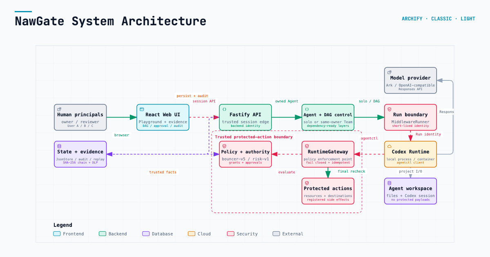
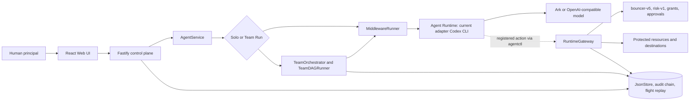

# NawGate

**Backend-enforced delegated access for autonomous Agents, built on the Volc
Agent Launchpad.**

NawGate keeps **Human**, **Agent**, and **Run** authority separate. A human's
access does not automatically become an Agent's access: the backend owns Agent
identity and grants, each Run receives short-lived authority, and every
registered protected action is decided and enforced at `RuntimeGateway`.

The repository also preserves the starter platform: Agent CRUD, a browser
Playground, persistent workspaces, multi-turn Codex sessions, local/container
execution, and Ark or OpenAI-compatible model configuration.

> [!WARNING]
> NawGate is a hackathon proof of concept. It protects registered actions routed
> through `agentctl` and `RuntimeGateway`; it does not intercept arbitrary Codex
> shell commands, filesystem operations, or network requests. Do not use real
> production data or credentials. See [SECURITY.md](SECURITY.md).

## The three independent layers

| Layer | Current implementation | Responsibility |
| --- | --- | --- |
| NawGate middleware | Fastify services, `bouncer-v5`, `risk-v1`, `RuntimeGateway` | Identity, policy, approval, enforcement, revocation, and safe evidence. |
| Agent Runtime | Codex CLI in a host process or disposable container | Executes Agent tasks, edits workspace files, and may request registered actions through `agentctl`. |
| Model provider | Volcengine Ark or an OpenAI-compatible Responses API | Supplies model inference to the Runtime and optional Team DAG planner; it is never an authorization authority. |

Codex CLI is the Agent Runtime adapter used by this Launchpad implementation;
it is **not an architectural dependency of NawGate**. A different Agent Runtime
can integrate by receiving backend-issued Run credentials and routing its
registered protected actions through `RuntimeGateway`.

## Screenshots

### Agent Playground


### Create an Agent


## Implemented capabilities

### Starter Agent platform

- React/TypeScript Web UI and Fastify control plane.
- Agent create, edit, start, stop, and delete lifecycle.
- Browser Playground with asynchronous Run state.
- Persistent Agent workspaces and Codex thread resume across turns.
- Local-process, disposable-container, Docker Compose, and Volcengine ECS
  profiles.
- Volcengine Ark and OpenAI-compatible Responses API providers.

### Bouncer identity and authorization

- Human ≠ Agent ≠ Run identity separation.
- Backend-owned Agent ownership and User A/User B isolation.
- Scoped, short-lived Runtime credentials that fail closed when missing,
  malformed, expired, or revoked.
- `PolicyEngine` decides; `RuntimeGateway` enforces and owns the final protected
  side effect.
- Deterministic `bouncer-v5` policy and backend-derived `risk-v1` tiers.
- `ALLOW`, `DENY`, and `REQUIRE_APPROVAL` outcomes with unknown action,
  resource, identity, or authority denied by default.
- Owner-resource allow, cross-user/cross-Team denial, and unknown-resource
  denial.

### Delegation, approval, and revocation

- Owner approval for medium/high-risk actions.
- Critical owner-plus-independent-reviewer approval using two distinct eligible
  humans.
- Exact, expiring, revocable, Run-bound, one-use capability claims.
- Approval cannot override cross-owner, unknown-resource, malformed-identity,
  expired, or revoked hard denies.
- Atomic capability consumption, idempotent same-request retry, payload and
  destination substitution rejection, and replay denial.
- Run and Agent Team Grant revocation invalidates pending/approved authority.
- Serialized final pre-side-effect recheck denies a queued action if authority
  changes before execution.

### Team authority and multi-Agent execution

- Backend-owned Team memberships and persistent Agent Team Grants.
- Independent viewer, editor, and admin roles, action scopes, expiry, bundle
  evidence, and explicit grant revocation.
- Restricted Team-file JIT access without mutating the Agent's persistent role.
- Same-owner Team execution; enrolling an Agent never bypasses cross-user Agent
  isolation.
- Optional model-assisted Team DAG planning with validation and deterministic
  fallback.
- Dependency-ready parallel execution plus a shared blackboard for sanitized
  artifacts and created-file references.

### Evidence and safety

- Deterministic DLP masking before prompts, outputs, audit explanations, or
  flight recordings are persisted.
- Redacted Delegation Receipts with policy, risk, authority, approval, and
  side-effect evidence—never credentials or protected payloads.
- Globally sequenced SHA-256 audit chaining after redaction.
- Audit-integrity quarantine: detected tampering keeps evidence readable but
  blocks new audit writes and registered protected side effects.
- Owner-scoped flight data recording and replay for completed Playground Runs.
- Local/demo Security Lab exercising the real RuntimeGateway for allow, deny,
  JIT, replay, forged-input, revocation, and queued stale-allow scenarios.

### Synthetic TikTok-oriented controls

- Registered `content.moderate`, `content.disclose`, `content.publish`, and
  `content.export` actions.
- Closed purpose set and backend-owned organisation → business centre → account
  → asset hierarchy.
- Registered destination catalogue and server-side synthetic credential broker.
- Moderation returns aggregate evidence without raw protected content;
  disclosure, publish, and export preserve exact account, asset, purpose,
  destination, version, and approval bindings.
- These resources and destinations are synthetic. The local adapter makes no
  external TikTok or arbitrary URL call.

## Selected middleware track: Bouncer

NawGate's primary TechJam story is backend-enforced identity and authorization.
The model may *request* an action, but it cannot choose the authenticated human,
Agent owner, Run, Team, grant, risk tier, approval outcome, or protected side
effect. Those facts are resolved and enforced by trusted backend services.

User A's Agent can read `project-a`; it cannot read User B's `project-b`.
Production deployment pauses for the owner, finalizes one exact one-use claim,
executes at most once after a final authority recheck, and produces redacted
evidence. See the [NawGate overview](docs/nawgate/overview.md),
[standards alignment](docs/nawgate/standards.md), and
[complete demo script](docs/nawgate/demo.md).

## Architecture

[](https://cloudkai.github.io/NawGate/docs/nawgate/architecture.html)

Explore the interactive [system architecture](https://cloudkai.github.io/NawGate/docs/nawgate/architecture.html),
[Agent/Team Run workflow](https://cloudkai.github.io/NawGate/docs/nawgate/workflow.html),
and [protected-action sequence](https://cloudkai.github.io/NawGate/docs/nawgate/sequence.html).
GitHub-readable companions are available for the [architecture](docs/nawgate/architecture.md),
[workflow](docs/nawgate/workflow.md), and [sequence](docs/nawgate/sequence.md).



## What judges can verify

| Capability | Demo action | Expected evidence |
| --- | --- | --- |
| Agent lifecycle and multi-turn continuity | Follow [workspace persistence](docs/nawgate/demo.md#31-workspace-persistence-and-multi-turn-execution). | Two successful Runs reuse one workspace and Codex thread. |
| Deterministic DLP | Submit the sample key/email prompt in the [DLP step](docs/nawgate/demo.md#32-real-time-data-loss-prevention-dlp-proxy). | UI and persisted evidence contain redaction markers, not the submitted secret/PII. |
| Owner allow and cross-user hard deny | Run the [owner read](docs/nawgate/demo.md#41-owner-resource-allow) and [cross-user read](docs/nawgate/demo.md#42-cross-user-hard-denial). | RuntimeGateway records ALLOW/SUCCESS for `project-a` and DENY/no side effect for `project-b`. |
| Approval and one-use authority | Run the [production approval](docs/nawgate/demo.md#43-production-approval-and-one-use-authority). | Wrong user cannot approve; owner approval issues and consumes one exact claim; replay cannot execute twice. |
| Team DAG and blackboard | Run the [parallel Team workflow](docs/nawgate/demo.md#51-parallel-full-stack-execution--shared-blackboard). | Validated DAG, dependency-ready tasks, per-Agent output, and shared artifacts appear. |
| Team grant and restricted-file JIT | Follow [Team enrollment](docs/nawgate/demo.md#6-team-membership-and-persistent-agent-enrollment) and the Security Lab JIT flow. | Viewer remains viewer; exact temporary file authority succeeds once. |
| Revocation race protection | Run the [final recheck scenario](docs/nawgate/demo.md#final-pre-side-effect-recheck). | Initially allowed queued action becomes terminal DENY with no side effect. |
| Audit integrity and flight replay | Follow [audit and replay](docs/nawgate/demo.md#8-audit-evidence-cryptographic-chain-integrity-and-flight-data-recorder-replay). | Integrity state, hash-linked redacted events, and owner-only sanitized Run replay are visible. |
| Full fail-closed scenario set | Run the [Security Lab sequence](docs/nawgate/demo.md#7-complete-security-lab-sequence). | Real-gateway allow, deny, forged input, replay, and Run/grant revocation results appear. |

## Quick start: complete judge demo

`npm run poc` is the canonical profile. It runs the React/Fastify control plane
on the host and starts every Agent turn in a disposable container containing
Codex CLI and `agentctl`.

### 1. Requirements

- macOS or Linux.
- Node.js 22+ and npm 10+.
- One running container engine: Docker, Colima, or Podman.
- One Responses-capable model and API key from either Ark or an OpenAI-compatible
  provider.

Check the current terminal:

```bash
node --version
npm --version
docker info     # Docker Desktop, Docker Engine, or Colima
podman info     # Use this instead when running Podman
```

Only one engine is required. If Node 22 is installed with Homebrew on macOS:

```bash
brew install node@22
export PATH="$(brew --prefix node@22)/bin:$PATH"
hash -r
node --version
```

With `nvm` on macOS or Linux:

```bash
nvm install 22
nvm use 22
node --version
```

### 2. Clone and configure

```bash
git clone https://github.com/CloudKai/NawGate.git
cd NawGate
cp .env.example .env
openssl rand -hex 24
```

Paste the generated value into `APP_AUTH_TOKEN` in `.env`, then choose exactly
one provider.

Option A — Volcengine Ark:

```dotenv
MODEL_PROVIDER=ark
ARK_API_KEY=your-ark-api-key
ARK_MODEL=ep-your-responses-endpoint-id
ARK_BASE_URL=https://ark.cn-beijing.volces.com/api/v3
```

Option B — OpenAI or another OpenAI-compatible Responses endpoint:

```dotenv
MODEL_PROVIDER=openai-compatible
OPENAI_API_KEY=your-provider-api-key
OPENAI_MODEL=your-responses-capable-model-id
OPENAI_BASE_URL=https://api.openai.com/v1
```

Only the selected provider's values are used. OpenAI replaces Ark as the model
endpoint; it does not replace the Agent Runtime.

### 3. Load the configuration and start

Run these as separate commands from the repository root:

```bash
set -a
source .env
set +a
npm run poc
```

Do not add trailing `\` characters between these commands. A trailing backslash
would join the next line into the same shell command.

The startup script:

1. verifies Node.js 22+ and the selected provider configuration;
2. detects Docker, Colima, or Podman;
3. chooses safe host data paths and a container-reachable gateway address;
4. installs dependencies when needed;
5. builds the disposable Agent Runtime image and application;
6. checks bind-mount and RuntimeGateway connectivity; and
7. starts the application on port 3000.

Codex CLI and `agentctl` are already installed in the POC image. A host Codex
installation and `CODEX_BIN` are not required for this profile.

### 4. Open and verify

Open [http://localhost:3000](http://localhost:3000) and enter the same
`APP_AUTH_TOKEN` stored in `.env`.

Create an Agent and run a normal first turn, then follow the
[complete NawGate demo](docs/nawgate/demo.md) for the protected-action,
multi-Agent, DLP, audit, replay, and Security Lab flows.

Press `Ctrl+C` to stop. Remaining disposable Runtime containers for this POC
instance are removed; Agent workspaces and conversations persist.

Default state locations:

- macOS: `~/.volc-agent-launchpad/`
- Linux: `.local/` in the repository
- Custom: set `LOCAL_POC_DATA_ROOT`

## Runtime profiles

| Profile | Intended use | Agent Runtime | Host Codex | Complete Playground protected-action demo |
| --- | --- | --- | --- | --- |
| `npm run poc` | Recommended judge demo | Disposable container per turn | No | **Yes** |
| Docker Compose | ECS-style packaged app | Codex inside the application container | No | No; local-process credential restriction applies |
| `npm run dev` | UI/API development | Host local process | Yes, through `CODEX_BIN` | No; use Security Lab or the container POC |

Protected-action credentials are deliberately not injected into local-process
Runs because the Agent and server child process share a filesystem. Normal
coding Runs work in every profile; use `npm run poc` for the complete
Playground → `agentctl` → RuntimeGateway demonstration.

### Docker Compose

Docker Compose packages the control plane and Codex CLI together in an
ECS-style application container. It is useful for deployment checks, but it is
not the recommended full protected-action judge path.

```bash
cp .env.example .env
# Fill APP_AUTH_TOKEN and one provider section.
docker compose --env-file .env config
docker compose up --build
```

Open [http://localhost:3000](http://localhost:3000). Stop without deleting
Agent data:

```bash
docker compose down
```

### Local-process development

Use this profile for Web/API iteration. It requires Node.js 22+, dependencies,
and a host Codex executable:

```bash
npm install
cp .env.example .env   # Skip if .env already exists.
```

The template leaves paths unset, so direct development uses safe repository
defaults rather than `/app`. Optional explicit values are:

```dotenv
APP_DATA_DIR=.local/data
AGENT_WORKSPACE_ROOT=.local/workspaces
CODEX_HOME=.local/codex-home
NAWGATE_GATEWAY_URL=http://127.0.0.1:3000
```

macOS with the ChatGPT application:

```bash
export PATH="$(brew --prefix node@22)/bin:$PATH"
set -a
source .env
set +a
export CODEX_BIN="/Applications/ChatGPT.app/Contents/Resources/codex"
"$CODEX_BIN" --version
npm run dev
```

Linux with Codex CLI installed globally:

```bash
npm install --global @openai/codex@0.111.0
set -a
source .env
set +a
export CODEX_BIN="$(command -v codex)"
"$CODEX_BIN" --version
npm run dev
```

- Web UI: [http://localhost:5173](http://localhost:5173)
- API: [http://localhost:3000](http://localhost:3000)

If a Run reports `spawn codex ENOENT`, see troubleshooting below. This error is
about the host Agent Runtime executable, not the Ark/OpenAI API key.

## Configuration reference

### Server and model provider

| Variable | Template/default | Purpose |
| --- | --- | --- |
| `HOST` | `0.0.0.0` | Control-plane listen address. |
| `PORT` / `PUBLIC_PORT` | `3000` | Server port and Compose host port. |
| `APP_AUTH_TOKEN` | Empty; required by POC | URL-safe browser unlock token. Use 24+ random characters. |
| `MODEL_PROVIDER` | `ark` | Choose `ark` or `openai-compatible`. |
| `ARK_API_KEY` / `ARK_MODEL` | Empty | Required only for the Ark provider. |
| `ARK_BASE_URL` | Beijing v3 endpoint | Ark OpenAI-compatible API base. |
| `OPENAI_API_KEY` / `OPENAI_MODEL` | Empty | Required only for the OpenAI-compatible provider. |
| `OPENAI_BASE_URL` | `https://api.openai.com/v1` | Responses API base; may be another compatible provider. |

### Runtime and NawGate

| Variable | Template/default | Purpose |
| --- | --- | --- |
| `RUNTIME_PROVIDER` | `local-process` | Direct-server default; `npm run poc` overrides to `container`. |
| `CODEX_BIN` | `codex` when unset | Host executable for local-process development only. |
| `CODEX_SANDBOX_MODE` | `workspace-write` | Inner Codex sandbox request; POC may fall back inside its outer container if Landlock is unavailable. |
| `CODEX_TIMEOUT_MS` | `600000` | Maximum Agent Runtime turn duration. |
| `CODEX_MAX_OUTPUT_BYTES` | `2097152` | Bound on captured Runtime output. |
| `NAWGATE_GATEWAY_URL` | Auto-selected | RuntimeGateway URL; leave unset for normal POC/local use. |
| `NAWGATE_APPROVAL_WAIT_MS` | `90000` | Bounded `agentctl` approval polling window; must be below `CODEX_TIMEOUT_MS`. |
| `NAWGATE_SECURITY_LAB_ENABLED` | `true` in demo template | Enables judge/demo Security Lab; set `false` outside an intentional demo. |

### Paths and container limits

| Variable | Template/default | Purpose |
| --- | --- | --- |
| `APP_DATA_DIR` | Auto/default | JsonStore and flight data. Leave unset for POC path selection. |
| `AGENT_WORKSPACE_ROOT` | Auto/default | Persistent Agent workspace root. |
| `CODEX_HOME` | Auto/default | Codex configuration and session storage. |
| `LOCAL_POC_DATA_ROOT` | Platform-specific | Optional root overriding all POC state locations. |
| `CONTAINER_ENGINE` | Auto-detected by POC | Force `docker` or `podman`; Colima uses the Docker CLI. |
| `CONTAINER_RUNTIME_IMAGE` | `volc-agent-runtime:local` | Disposable Agent Runtime image name. |
| `CONTAINER_CPU_LIMIT` | `2` | CPU limit per Runtime container. |
| `CONTAINER_MEMORY_LIMIT` | `2g` | Memory limit per Runtime container. |
| `CONTAINER_PIDS_LIMIT` | `256` | Process limit per Runtime container. |

See [.env.example](.env.example) for build mirror, package, user, and instance
overrides. Pre-rename environment aliases are not supported; use `NAWGATE_*`.

## Troubleshooting

| Symptom | Cause and fix |
| --- | --- |
| `Node.js 22+ is required; found v20...` | Select Node 22 in the same terminal: `nvm use 22`, or prepend Homebrew's `node@22` directory to `PATH`, then run `hash -r`. |
| `EADDRINUSE ... port 3000` | Another server owns the port. Run `lsof -nP -iTCP:3000 -sTCP:LISTEN`, verify the PID, and stop only that stale process—or use the healthy existing instance. |
| `ENOENT ... mkdir '/app'` | An older host `.env` exported container-only paths. Remove/comment `APP_DATA_DIR=/app/data`, `AGENT_WORKSPACE_ROOT=/app/workspaces`, and `CODEX_HOME=/app/codex-home`, or migrate values from the current template. |
| No Docker/Colima/Podman engine found | Start one engine and verify `docker info` or `podman info`. Leave `CONTAINER_ENGINE` unset for auto-detection. |
| Agent Runtime cannot reach `127.0.0.1:3000` | An older `.env` fixed `NAWGATE_GATEWAY_URL`. Remove/comment it so `npm run poc` selects the container-reachable host address. |
| Browser token is invalid | Enter the exact `APP_AUTH_TOKEN` loaded before startup. Restart the server after changing `.env`; do not print the token during a demo. |
| Provider/model not configured | Ensure `MODEL_PROVIDER` matches the filled Ark or OpenAI section and the model supports the Responses API. |
| `spawn codex ENOENT` | Only local-process development needs host Codex. Set `CODEX_BIN` to a working absolute path and restart, or use `npm run poc`. |
| Bind mount rejected | Set `LOCAL_POC_DATA_ROOT` to a directory shared with Docker/Colima/Podman. |

More platform-specific help is in [Local POC](docs/LOCAL_POC.md).

## Deployment

- [Existing Linux ECS with Docker](docs/DEPLOYMENT.md#existing-linux-ecs)
- [Complete Volcengine environment with Terraform](docs/DEPLOYMENT.md#terraform-deployment)
- [Rootless Podman and local Runtime details](docs/LOCAL_POC.md#rootless-podman-on-linux)

Existing-ECS deployment:

```bash
cp .env.example .env.production
# Fill APP_AUTH_TOKEN and the selected provider values.
./scripts/deploy-existing-ecs.sh .env.production
```

Terraform deployment:

```bash
cp .env.example .env.production
cp deploy/volcengine/terraform.tfvars.example deploy/volcengine/terraform.tfvars
# Fill both files, then export the Volcengine infrastructure credentials.
./scripts/deploy-volcengine.sh
```

Set `NAWGATE_SECURITY_LAB_ENABLED=false` outside an intentional protected demo.

## Scope and factual limitations

- NawGate protects only registered actions routed through `agentctl` and
  `RuntimeGateway`; it does not intercept arbitrary Agent Runtime activity.
- Protected credentials are not injected into local-process Runs; use the
  disposable-container POC for the complete protected-action Playground demo.
- Protected resources remain outside Agent workspaces.
- Disposable containers are not hardened multi-tenant or network isolation.
- `JsonStore`, Team DAG orchestration, and blackboard state are single-process
  POC components without high availability or distributed queues.
- Audit chaining is tamper-evident, not externally immutable.
- Model providers and model-assisted DAG planning are never authorization
  authorities.
- TikTok-oriented content, destinations, and credentials are synthetic and no
  external TikTok call occurs.

## Validation

```bash
npm run check
CONTAINER_ENGINE=docker npm run test:container  # Requires a real container engine
docker compose --env-file .env config
terraform fmt -check -recursive deploy/volcengine
```

`npm run check` runs TypeScript checks, deterministic tests, and both builds.
`npm run test:container` is separately gated and must not be reported as passed
unless a real Docker/Podman container completed it.

## Documentation

- [Architecture overview](docs/ARCHITECTURE.md)
- [NawGate architecture (interactive)](https://cloudkai.github.io/NawGate/docs/nawgate/architecture.html)
- [NawGate architecture (Markdown)](docs/nawgate/architecture.md)
- [NawGate workflow (interactive)](https://cloudkai.github.io/NawGate/docs/nawgate/workflow.html)
- [NawGate workflow (Markdown)](docs/nawgate/workflow.md)
- [NawGate sequence (interactive)](https://cloudkai.github.io/NawGate/docs/nawgate/sequence.html)
- [NawGate sequence (Markdown)](docs/nawgate/sequence.md)
- [Complete judge demo](docs/nawgate/demo.md)
- [NawGate decisions](docs/nawgate/decisions.md)
- [NawGate standards alignment](docs/nawgate/standards.md)
- [Local POC](docs/LOCAL_POC.md)
- [Deployment](docs/DEPLOYMENT.md)
- [Security policy](SECURITY.md)
- [Contributing](CONTRIBUTING.md)

## License

[MIT](LICENSE)
