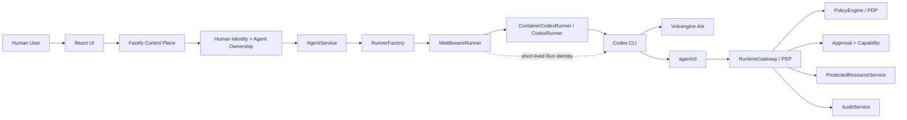
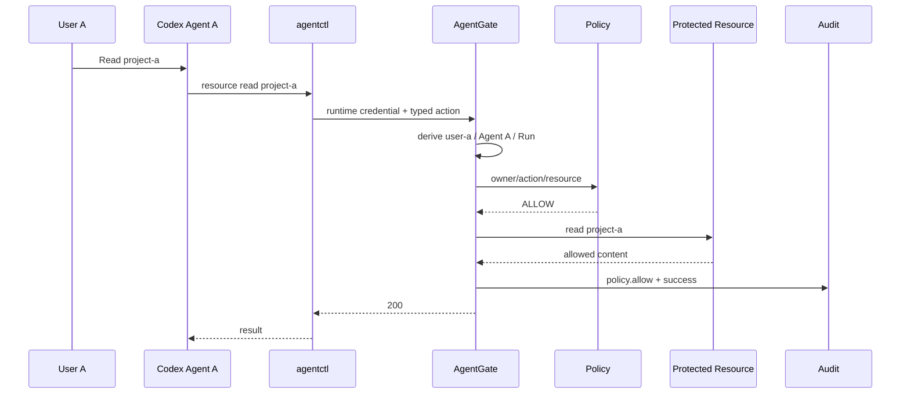
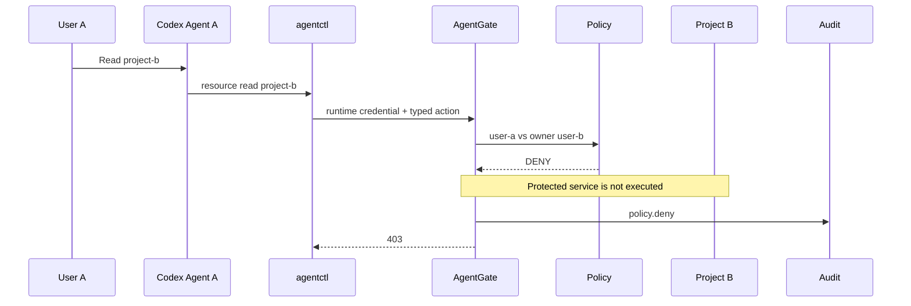
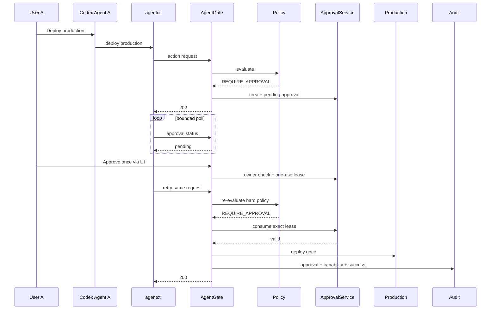

# System Design Walkthrough

## Main path

## Allowed own-resource sequence

## Cross-user denial

## Human approval

## Important detail

On retry after approval, re-evaluate hard policy before consuming lease.

Do not skip from "approved" straight to side effect.

If owner/resource state changed, stale approval must not bypass policy.

## Archify

`design/agentgate-codejam.architecture.json` and `design/agentgate-codejam.workflow.json` are Archify-native typed sources for presentation-quality diagrams.

Mermaid here is for implementation readability.
