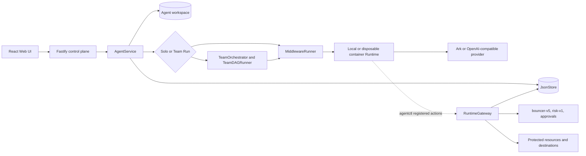

# Architecture

The Agent Launchpad is a single-node control plane for hackathon use. NawGate
adds backend-enforced delegated authorization, in-process multi-Agent DAG
coordination, redacted observability evidence, and tamper-evident audit
integrity without replacing the starter Agent lifecycle.



Detailed NawGate views:

- [System architecture](nawgate/architecture.md)
- [Agent and Team Run workflow](nawgate/workflow.md)
- [Registered protected-action sequence](nawgate/sequence.md)

## Components

### Web UI and Fastify control plane

The React UI manages Agents, Playground Runs, Team Run graphs and blackboard
state, approvals, audit evidence, and flight replay. Fastify validates requests,
derives the demo human session, serves the UI, and composes trusted services.
The remote shared bearer token protects deployment access but is not a user
identity or authorization decision.

### Agent and Team Run control

`AgentService` owns Agent lifecycle, ownership checks, messages, workspaces,
thread resume, and solo-versus-team routing. One Agent can have only one active
Run.

Team coordination is implemented. `TeamOrchestrator` may ask the configured
model for a task DAG, validates that graph, and falls back to deterministic
heuristics. `TeamDAGRunner` executes dependency-ready tasks in parallel and
shares sanitized artifacts and created-file references through an in-process
blackboard. Participating Agents remain scoped to their authenticated owner;
team enrollment does not bypass cross-user isolation.

This is not distributed orchestration: there is no external scheduler,
distributed queue, high-availability coordinator, or cross-process blackboard.

### NawGate enforcement

Every Run receives short-lived backend-owned runtime identity. `PolicyEngine`
decides and `RuntimeGateway` enforces registered protected actions. Approval
cannot override a hard deny. Owner revocation invalidates Run identity and
active capabilities; exact one-use claims, final transactional rechecks, and
idempotency prevent replay or stale queued execution.

NawGate applies to the optional `agentctl` → `RuntimeGateway` branch. It does
not intercept every internal Codex shell command, file operation, or network
request.

### Storage and observability

```text
data/launchpad.json       Agent, Run, Team DAG, authority, receipt, and audit state
workspaces/AgentID/       Agent-created files
workspaces/.deleted/      Archived deleted workspaces
codex-home/               Codex configuration and sessions
flight-data/              DLP-sanitized Run flight recordings
```

`JsonStore` serializes writes and atomically replaces one JSON file for one
process. Audit events are redacted before being linked in a persisted SHA-256
chain. This detects tampering but is not external immutability. Flight replay
supports owner-only debugging and is not an authorization input.

### Runtime providers

- `CodexRunner` runs Codex as a child process for local development and the ECS
  profile.
- `ContainerCodexRunner` starts one disposable Docker, Colima, or Podman
  container for each local POC turn.

Both use argv-only process execution, bounded output/time, stored Codex thread
resume, and escalating termination after a grace period. The container option
is disposable but not hardened multi-tenant or network isolation.

## Deployment profiles

| Profile | Control plane | Agent execution |
| --- | --- | --- |
| Local POC | Host Node.js | Disposable local container |
| ECS | Application container | Codex process in the same container |
| Local development | Host Node.js | Host Codex process |

Ark and OpenAI-compatible providers are external text-generation dependencies.
They may assist DAG planning but are never identity, policy, risk, approval, or
redaction authorities.
