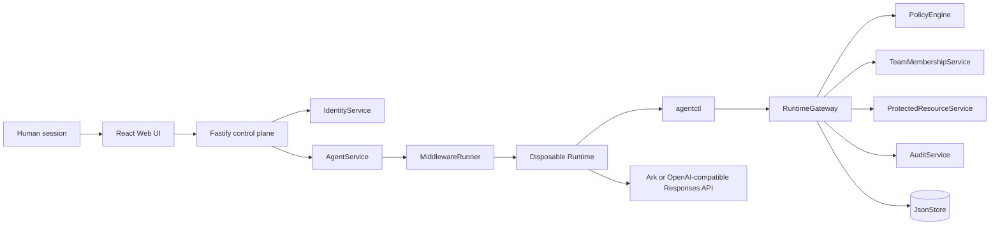

# AgentGate architecture

## Trust boundaries

The browser session is a human control-plane credential, not the Agent's
runtime identity. The browser cannot choose `humanId`, `ownerUserId`, `agentId`,
or `runId` for a protected action. The backend derives those values from the
stored Agent and the issued Run credential.

For team-owned files, the Runtime also cannot assert a team or role. The
gateway resolves the current human-to-team relationship from trusted store
data and passes those attributes to the policy decision. This keeps team
membership out of the untrusted action request.

`PolicyEngine` is a pure decision component. `RuntimeGateway` enforces its
decision and calls the protected-resource boundary only after authorization.
Protected payloads remain behind that boundary and are never written into an
Agent workspace or audit event.

## Main flows

1. `AgentService` starts a Run and `MiddlewareRunner` issues a scoped identity.
2. `agentctl` submits a registered action through the Runtime gateway.
3. The gateway denies unknown or cross-owner resources, allows low-risk owned
   reads/staging deploys, or creates a pending production approval.
4. Only the owning human can approve. The capability is exact-bound and usable
   once.
5. Run completion, failure, cancellation, or explicit owner revocation removes
   runtime authority. Explicit revocation also invalidates pending and approved
   capabilities.
6. A team-file read follows the same gateway path, but policy additionally
   requires an active team relationship whose role meets the protected file's
   classification threshold.

The revocation endpoint is `POST /api/agents/:id/revoke-access` and is exposed
only to the current human owner. It revokes authority; it does not claim to
terminate every internal Codex operation already running in the container.
