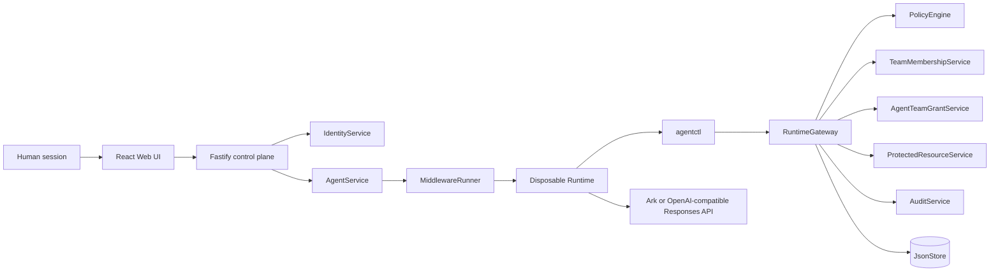

# AgentGate architecture

## Trust boundaries

The browser session is a human control-plane credential, not the Agent's
runtime identity. The browser cannot choose `humanId`, `ownerUserId`, `agentId`,
or `runId` for a protected action. The backend derives those values from the
stored Agent and the issued Run credential.

For team-owned files, the Runtime also cannot assert a team, role, or Agent
grant. The gateway resolves both the current human-to-team relationship and
the persistent Agent-to-team grant from trusted store data. Policy intersects
those server-owned attributes with the Run and protected resource.

`PolicyEngine` is a pure decision component. `RuntimeGateway` enforces its
decision and calls the protected-resource boundary only after authorization.
Protected payloads remain behind that boundary and are never written into an
Agent workspace or audit event.

## Main flows

1. `AgentService` starts a Run and `MiddlewareRunner` issues a scoped identity.
2. `agentctl` submits a registered action through the Runtime gateway.
3. The gateway denies unknown or cross-owner resources, allows low-risk owned
   reads/staging deploys, or creates a pending production approval.
4. Only the owning human can approve. The capability is exact-bound and usable
   once.
5. Run completion, failure, cancellation, or explicit owner revocation removes
   runtime authority. Explicit revocation also invalidates pending and approved
   capabilities.
6. An owning human who is also a current team admin may enroll an Agent with a
   narrow persistent `file.read` role bundle. Enrollment and revocation are
   separate from per-Run authority.
7. A team-file read additionally requires current human membership and role,
   an active/unexpired Agent grant with sufficient role and action scope, and
   active Run authority.
8. The gateway serializes protected side effects and re-resolves authority,
   memberships, grants, and resource metadata immediately before execution.

The revocation endpoint is `POST /api/agents/:id/revoke-access` and is exposed
only to the current human owner. It revokes authority; it does not claim to
terminate every internal Codex operation already running in the container.

Persistent enrollment uses `GET/POST /api/agents/:id/team-grants` and
`POST /api/agents/:id/team-grants/:grantId/revoke`. The current POC requires
the same human to own the Agent and hold the team-admin relationship.
