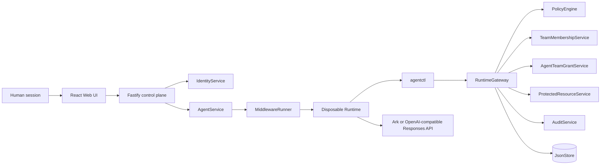

# AgentGate architecture

Interactive architecture: [architecture.html](architecture.html)
The interactive map is source-evidence-backed to commit
`028013c809134303a2d60dd0acff86efe9f4d156`. It is the judge-facing overview;
this page is the concise GitHub-readable companion.

## Compact GitHub fallback



## Trust boundaries

AgentGate keeps **Human != Agent != Run**. The browser session represents a
human control-plane principal. It cannot select `humanId`, `ownerUserId`,
`agentId`, `runId`, team membership, grant, role, or policy outcome for a
protected action. The backend resolves the Agent owner from storage and gives
each Run a scoped, short-lived runtime identity.

For team-owned files, the Runtime also cannot assert a team, role, or Agent
grant. The gateway resolves both the current human-to-team relationship and
the persistent Agent-to-team grant from trusted store data. Policy intersects
those server-owned attributes with the Run and protected resource.

`PolicyEngine` is a pure decision component. `RuntimeGateway` enforces its
decision and calls the protected-resource boundary only after authorization.
Protected payloads remain behind that boundary and are never written into an
Agent workspace or audit event.

`RuntimeGateway` is the Policy Enforcement Point (PEP). The deterministic
`PolicyEngine` is the Policy Decision Point (PDP). The model may request a
registered action through `agentctl`; it never decides whether the outcome is
allow, deny, or approval-required. Ark/OpenAI-compatible model traffic is a
separate Runtime dependency, not an authorization authority.

## Main flows

1. `AgentService` starts a Run and `MiddlewareRunner` issues a scoped identity.
2. `agentctl` submits a registered action through the Runtime gateway.
3. The gateway denies unknown or cross-owner resources, allows low-risk owned
   reads/staging deploys, or creates a pending production approval.
4. Only the owning human can approve. The capability claim is exact-bound and
   usable once; its canonical payload digest, optional destination, policy
   revision, and resource revision are persisted with the claim metadata.
5. Run completion, failure, cancellation, or explicit owner revocation removes
   runtime authority. Explicit revocation also invalidates pending and approved
   capabilities.
6. An owning human who is also a current team admin may enroll an Agent with a
   narrow persistent `file.read` role bundle. Enrollment and revocation are
   separate from per-Run authority.
7. A team-file read additionally requires current human membership and role,
   an active/unexpired Agent grant with sufficient role and action scope, and
   active Run authority.
8. The gateway serializes protected side effects and re-resolves authority,
   memberships, grants, and resource metadata immediately before execution.

## Purpose-bound synthetic content actions

Phase 2 adds four registered, deterministic local actions to the same gateway:

```text
content.moderate  -> safety_moderation
content.disclose  -> approved_analytics
content.publish   -> creator_requested_publish
content.export    -> compliance_archive
```

Each request carries a strict structured binding for the synthetic
organisation, business centre, account, asset, and content version. The
backend resolves the registered asset metadata and rejects any hierarchy,
purpose, version, or destination mismatch. Moderation is processing-only and
returns an aggregate result; raw protected content is returned only by
`content.disclose` after an exact backend-approved disclosure scope matches
the human, hierarchy, account, asset, purpose, and analytics destination.
Publish and export pause for the existing owner approval flow, so the durable
one-use capability remains bound to the full request payload and destination.
The destinations and content are synthetic identifiers/data; no external
TikTok or arbitrary URL calls are made.

## Bouncer v4: temporary JIT elevation

`bouncer-v4` keeps persistent Agent enrollment separate from exceptional
authority. Effective team-file authority is the intersection of:

```text
human Team membership
AND persistent Agent Team grant
AND temporary Run identity
AND exact one-use JIT capability (when required)
AND protected-resource requirements
```

A missing human membership, wrong team, missing/revoked/expired/under-scoped
grant, malformed trusted attribute, or unknown resource is a **hard DENY**.
Approval never repairs those conditions. A Team Alpha human with a valid
viewer `file.read` grant may instead receive **REQUIRE_APPROVAL** only for an
eligible restricted Team Alpha file. The approval is bound to the human,
Agent, Run, request ID, file, action, grant ID, bundle version, and effective
scope. It grants a single temporary read; it never mutates `AgentTeamGrant`.

The gateway re-resolves the Run authority, human membership, persistent grant,
resource metadata, policy, and exact capability immediately before the
protected side effect. Revocation or changed authority at that point denies
the queued action without executing it. The `JsonStore` mutation that changes
an approved claim to consumed also sets `remainingUses` to zero in the same
atomic persisted transition, so a concurrent retry cannot consume it twice.

### Policy outcomes

- **ALLOW:** User A's valid Team Alpha viewer grant can read an internal Team
  Alpha file.
- **REQUIRE_APPROVAL:** the same viewer requesting a restricted Team Alpha
  file is JIT-eligible only after all hard prerequisites pass.
- **DENY:** cross-user or cross-team access, missing membership, missing,
  revoked, expired, or under-scoped grant, invalid Run authority, replayed
  capability, forged attributes, malformed request, and unknown resource all
  fail closed. Approval never repairs a hard deny.

The resulting JIT capability is bound to one human, Agent, Run, request ID,
action, resource, canonical payload digest, optional destination,
grant/bundle, policy revision, resource revision, and effective scope. It
expires, is revocable, is consumed once, and does not turn a persistent viewer
grant into an editor grant.

## Revocation, replay, and final recheck

Owner Run revocation invalidates the runtime credential and pending/approved
capability claims. Agent Team Grant and protected-resource revision revocation
likewise invalidate related claims. `RuntimeGateway` serializes protected
execution and re-resolves mutable authority immediately before capability use
and again adjacent to the registered protected side effect. This blocks a
queued initial allow after authority has changed. Stored execution records make
same-request retries idempotent and reject payload/destination/request
substitution conflicts.

## Audit and Delegation Receipt

`AuditService` records redacted decision evidence: Human, Agent, Run, action,
resource ID, team/grant/bundle metadata, decision/reason, approval/capability
status, policy version, enforcement point, and whether the protected side
effect executed. The Web Delegation Receipt is a safe human-readable view of
that evidence. Neither surface includes a raw runtime credential, API key, or
protected payload.

## Security Lab

The local-only Security Lab calls the real `RuntimeGateway`; the Web UI never
calculates a policy decision. Its JIT scenario keeps the trusted context and
runtime credential server-side under an opaque scenario reference. After the
owner approves, the server retries the exact request on the same Run, consumes
the capability, and closes the demo Run. Terminal success, denial,
cancellation, error, and timeout revoke demo authority and pending/approved
capabilities.

For the queued-revocation scenario, a server-only local-demo barrier pauses an
initially allowed request before its final recheck. The lab revokes authority,
releases the barrier, and returns the actual final deny result. No browser or
Runtime request can create this barrier, and it is not an authorization bypass.

The revocation endpoint is `POST /api/agents/:id/revoke-access` and is exposed
only to the current human owner. It revokes authority; it does not claim to
terminate every internal Codex operation already running in the container.

Persistent enrollment uses `GET/POST /api/agents/:id/team-grants` and
`POST /api/agents/:id/team-grants/:grantId/revoke`. The current POC requires
the same human to own the Agent and hold the team-admin relationship.

## Scope limits

AgentGate protects registered actions routed through `agentctl` and
`RuntimeGateway`. It does not claim to intercept every internal Codex shell
command, arbitrary local filesystem operation, or arbitrary network request.
It is a single-process hackathon POC with demo identities/relationships and
ordinary disposable containers—not enterprise IAM, SSO/OIDC, distributed
authorization, or hardened multi-tenant isolation.
