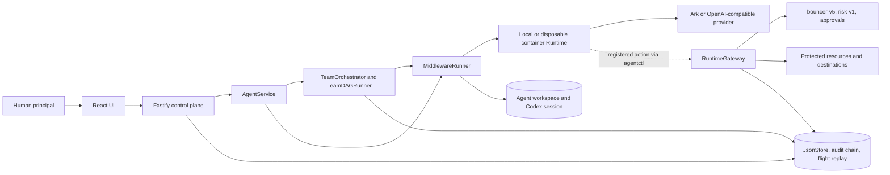

# NawGate architecture

NawGate is the backend-enforced delegated-access layer in the Agent Launchpad.
It keeps Human, Agent, and Run authority separate while preserving normal solo
and multi-Agent Playground execution. This document describes the code at
revision `7c5b038ed2729d1298b1d58ea812d5b9f8a78a6a`.

Explore the [interactive system architecture](https://cloudkai.github.io/CodeJam/nawgate/architecture.html),
the [Agent/Team Run workflow](workflow.md), or the
[protected-action sequence](sequence.md).

## System overview

The primary path is Human → React UI → Fastify → `AgentService` → solo or Team
Run → `MiddlewareRunner` → Codex Runtime → model provider. A model-requested
registered protected action takes an optional branch through `agentctl` and
`RuntimeGateway`; ordinary shell, filesystem, and network activity does not.

## Major components

| Component | Responsibility |
| --- | --- |
| React UI | Agent lifecycle, Playground, Team Run graph/blackboard, approvals, audit, flight replay, and Security Lab views. |
| Fastify control plane | Authenticated session boundary, validated API routes, static UI, and trusted service composition. |
| `AgentService` | Backend-owned Agent ownership, CRUD, Run lifecycle, solo/team routing, message persistence, and thread resume. |
| `TeamOrchestrator` / `TeamDAGRunner` | Optional model-assisted DAG planning with deterministic fallback; validated dependency-ready execution and shared blackboard updates. |
| `MiddlewareRunner` | Creates short-lived Run authority around a Runtime turn, redacts leaked credentials, records flight data, and revokes authority on terminal paths. |
| Codex Runtime | Local-process or disposable-container Agent execution with `agentctl` available for registered protected actions. |
| `RuntimeGateway` | Policy enforcement point: trusted identity resolution, idempotency, audit-integrity preflight, final recheck, capability consumption, and protected side effects. |
| Policy and authority services | Deterministic `bouncer-v5`, `risk-v1`, memberships, persistent Agent Team Grants, approval authorities, one-use claims, and revocation. |
| Protected boundary | Synthetic protected resources, purpose-bound content actions, registered destinations, and the server-side credential broker/local adapter. |
| State and evidence | Single-process `JsonStore`, hash-chained redacted audit events, Runs/messages/team DAGs, approvals, execution receipts, and sanitized flight recordings. |
| Workspace/session storage | Agent-created files and Codex session state, separate from protected resources. |
| Model provider | Ark or an OpenAI-compatible endpoint for Codex and optional DAG planning; never an authorization authority. |

## Primary paths

### Solo and Team Runs

The backend resolves the authenticated human and Agent owner before accepting a
prompt. DLP masking is applied before persistence. An Agent without an active
team grant follows the solo path. An Agent with active same-owner team grants
routes to a Team Run: the orchestrator validates a model-generated DAG or uses
the deterministic fallback, and the DAG runner executes dependency-ready tasks
in parallel. Sanitized outputs, artifacts, and referenced workspace files are
published to the shared blackboard for dependent tasks.

Team enrollment never bypasses cross-user Agent isolation. The participating
Agents must be owned by the authenticated human and have active grants for the
same team.

See the [interactive workflow](https://cloudkai.github.io/CodeJam/nawgate/workflow.html)
or its [GitHub-readable companion](workflow.md).

### Registered protected actions

Each Run receives a scoped, short-lived credential. `agentctl` submits a
registered request to `RuntimeGateway`, which derives Human, Agent, and Run
identity from server-owned state. The gateway verifies audit integrity and
idempotency, resolves resources, team/grant state and destination metadata,
then applies deterministic policy and risk decisions.

`ALLOW` may execute only after the final transactional recheck. `DENY` has no
side effect. `REQUIRE_APPROVAL` can issue an exact, expiring, revocable,
Run-bound, one-use capability after eligible human decisions; critical actions
require distinct owner and independent-reviewer approvals. Approval never
repairs a hard deny. Replay and revocation races fail closed.

See the [interactive sequence](https://cloudkai.github.io/CodeJam/nawgate/sequence.html)
or its [GitHub-readable companion](sequence.md).

## Data and state

- `launchpad.json` stores Agents, Runs, messages, Team Runs and DAG state,
  memberships and grants, runtime authority, approvals/capabilities, safe
  execution records, and redacted audit evidence.
- Audit events are globally sequenced and linked with SHA-256 hashes after
  redaction. Verification failures quarantine new protected side effects and
  audit writes; the chain is tamper-evident, not externally immutable.
- Sanitized flight recordings support owner-only post-run inspection and replay
  views. They are observability evidence, not an authorization input.
- Agent workspaces and Codex sessions persist separately. Protected resources
  and destination credentials are never mounted into Agent workspaces.

## Trust boundaries

- **Browser boundary:** the browser requests control-plane operations but
  cannot assert trusted Human, Agent, Run, owner, team, role, grant, risk, or
  approval facts.
- **Backend boundary:** Fastify and its services resolve identity and own
  authorization state. `PolicyEngine` decides; `RuntimeGateway` enforces.
- **Runtime boundary:** Codex is untrusted for authorization. A Run receives
  only temporary scoped authority, and raw Runtime credentials are never
  persisted or shown in UI/audit evidence.
- **Protected-action boundary:** only registered requests through the gateway
  can reach protected resources, destinations, and the credential broker.
- **Persistence boundary:** `JsonStore` serializes one-process mutations and
  final rechecks. It is not a distributed database or queue.
- **External-provider boundary:** model providers generate text/plans but never
  determine permission, risk, approval, or redaction outcomes.

## Architectural decisions

- Authorization uses backend-controlled facts and deterministic policy; no LLM
  is part of the security decision path.
- Approval can satisfy only `REQUIRE_APPROVAL`, never cross-owner, cross-team,
  unknown-resource, malformed-identity, expired, or revoked hard denies.
- Persistent Agent grants, temporary Run identity, and one-use JIT capability
  are separate authority layers.
- Protected side effects are serialized with capability consumption and a final
  re-resolution of mutable authority to close revocation races.
- DAG coordination is intentionally in-process. The optional model planner is
  validated, and failure falls back to deterministic planning.

## Current limitations

- NawGate protects registered actions routed through `agentctl` and
  `RuntimeGateway`, not arbitrary Codex shell, filesystem, or network activity.
- Protected credentials are not injected into local-process Runs; the container
  Runtime is required for the complete protected-action demo.
- Destinations and TikTok-oriented resources are synthetic and make no external
  TikTok call.
- Disposable containers are not hardened multi-tenant or network isolation.
- `JsonStore` and DAG orchestration are single-process POC components without
  high availability or distributed queues.
- Audit chaining is tamper-evident, not externally immutable.
- Model providers and the optional model-assisted DAG planner are never
  authorization authorities.
