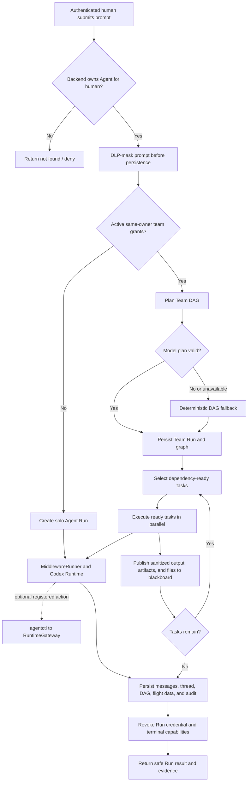

# Agent and Team Run workflow

This workflow shows how the current backend accepts a Playground prompt, keeps
Agent ownership scoped to the authenticated human, selects solo or multi-Agent
execution, and persists safe operational evidence.

Explore the [interactive workflow](https://cloudkai.github.io/NawGate/docs/nawgate/workflow.html).
For system boundaries, see the [architecture overview](architecture.md). For a
registered protected action requested during a Run, see the
[protected-action sequence](sequence.md).

## GitHub fallback

## Workflow rules

1. Fastify resolves the authenticated human; `AgentService` looks up the Agent
   and its backend-owned `ownerUserId`. A caller cannot select another owner by
   sending an ID in the request body.
2. Prompt DLP masking happens before the prompt is persisted or sent into solo
   or Team Run planning.
3. An ordinary Agent takes the solo path. Active Agent Team Grants may select
   the Team path only for Agents owned by the same authenticated human. Team
   membership does not bypass cross-user Agent isolation.
4. `TeamOrchestrator` asks the configured provider for a DAG only when a model
   is configured. The result must reference eligible Agents and form a valid
   acyclic graph. Invalid, unavailable, or failed model planning falls back to
   deterministic heuristics.
5. `TeamDAGRunner` releases dependency-ready tasks in layers and executes tasks
   in the same layer in parallel. A task receives sanitized blackboard context
   from prior tasks, including published artifacts and created-file references.
6. `MiddlewareRunner` wraps each Runtime turn with short-lived Run authority,
   redacts any echoed credential, and records sanitized flight data. A Runtime
   may request a registered action, but the complete authorization path remains
   inside `RuntimeGateway` and is documented separately.
7. Messages, Run status, Codex thread IDs, Team Run graph/blackboard state,
   redacted audit events, and flight recordings are persisted for the owner.
8. Completion, failure, cancellation, and explicit revocation terminate Run
   authority and invalidate pending or approved one-use capabilities.

## Failure behavior

Ownership mismatch, stopped/busy state, an unusable Team graph, task failure,
or audit-integrity quarantine fails closed. Partial Team Run progress remains
inspectable as safe state and audit evidence; it does not grant additional
authority or cause a protected side effect.
